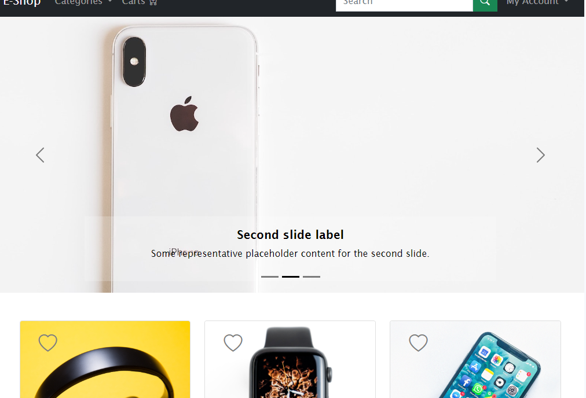
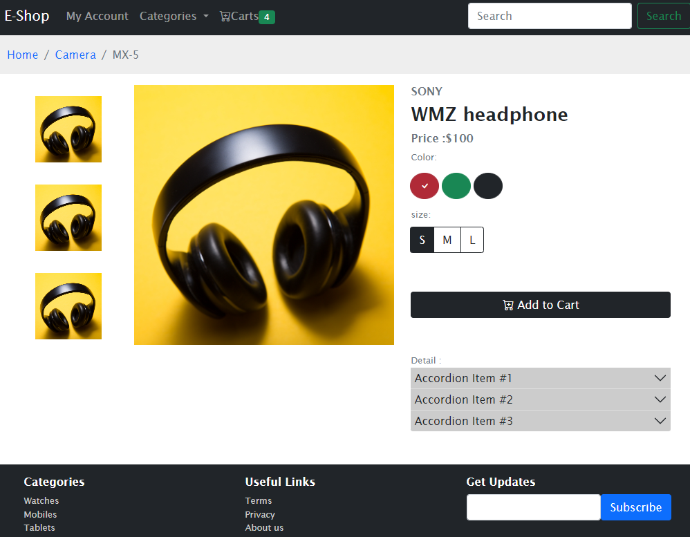
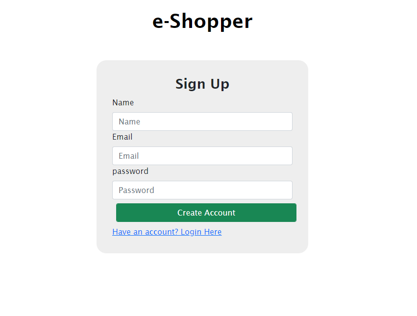

# Ecommerce website template

Ecommerce website template build with HTML, CSS and Bootstrap only.

# Installation

- to run in locally for education purpose
- download or clone repository
- run the index.html on local server

# live application

[Project Management](https://ecomm-bootstrap.vercel.app/)

## Home Page

## Product Page

## Sign Up Page

# Features and Technologies uses

- HTML
- CSS
- Bootstrap
